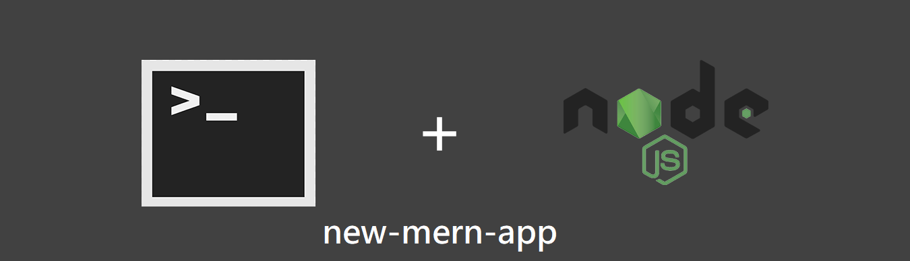
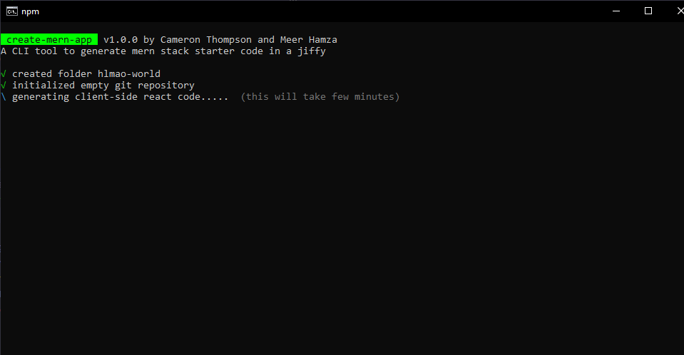
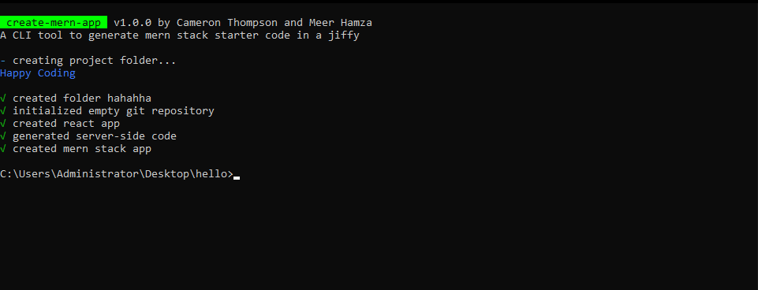
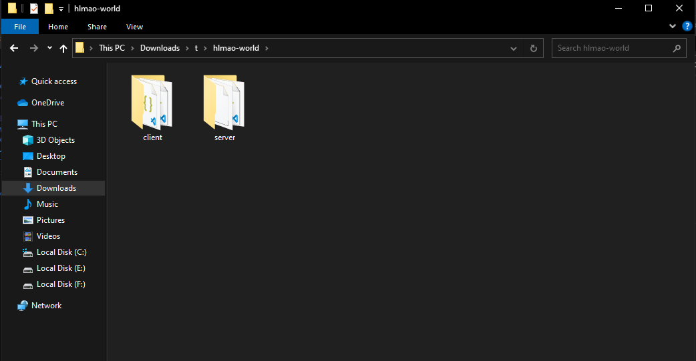

 <div align="center">
	
	
 </div>
 <p align="center">
    An open-source automation tool that generates MERN stack code with JWT configured through a single command.
 </p>
<hr />

## 🚀 Installation

 ```bash
 # install the dependencies
  npm i -g new-mern-app

 # create project
  create [project-name]
 
 # use it with npx (recommended)
  npx new-mern-app [project-name]
```
## 🔎 Preview
Once you run the above command the preview of the cli would be 



## 📦 Folder Structure


run `npm install` in the server folder to download relevant dependencies.


## 👨🏻‍💻 Contributing

Make sure you read the [contributing guidelines](https://github.com/meerhamzadev/mongo-express-node-template/blob/master/contributing.md) before opening a PR.

## 🔑 License
- MIT © [Meer Hamza](https://github.com/meerhamzadev)

## ⚡ AUTHOR

🙋🏻‍♂️ Yo! It's Meer, a junior year CS undergrad. Let's get connected

<a href="https://twitter.com/meerhamzadev"></a>&nbsp;
<a href="https://linkedin.com/in/meerhamzadev/"></a>&nbsp;
<a href="mailto:hamzababar37@gmail.com?subject=From%20GitHub&body=Hi,%20there.%20Found%20you%20from%20GitHub."></a>&nbsp;
